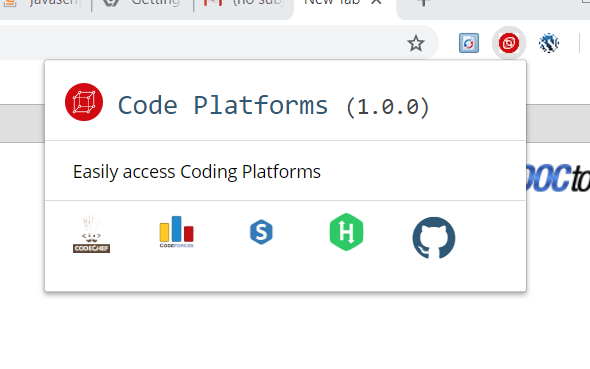

# coding-platforms
This is an extension that shows all the coding platforms i work on.

“Code Platforms” Extension:
This is an extension that I have made using HTML and CSS.
This extension is created to provide an easy access to all the coding platforms that I work on. My profile on the various coding platforms can be viewed simply by clicking on the icons of the concerned coding platforms.
How the extension was developed:
1)	Firstly I created the “manifest.json” file stating name, version, manifest version along with the icon details of the extension. 
2)	The HTML page that pops-up when click the icon is clicked was thereafter created by me.
3)	Thereafter I linked all the icons of the various coding platforms that I work on to the profile page of my account on the respective platforms.
4)	Finally I uploaded the extension by going on chrome://extensions and then it worked!
Screen shot of my project:--

